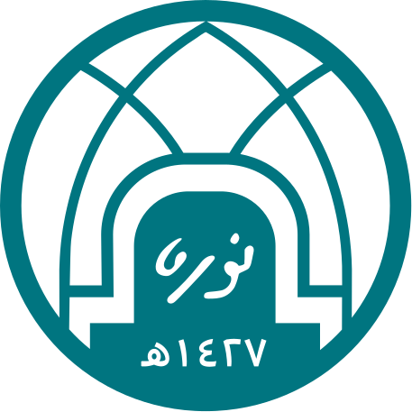
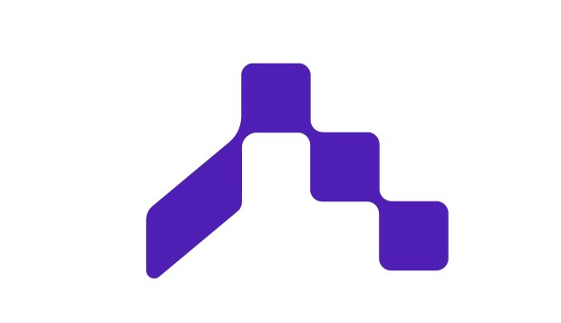

# 👋 Hi, I'm Ohood Albuqami

<p align="left">
  
  &nbsp;&nbsp;&nbsp;
  
</p>

Flutter Developer & Business Analyst — I turn messy manual processes into clean digital workflows 🚀

## 🌐 Connect
[](https://www.linkedin.com/in/ohood-albuqami)
[](mailto:ohoodalbagami1@gmail.com)

## 💫 About Me
```yaml
role: Flutter Developer & Business Analyst
location: Riyadh, Saudi Arabia
education: B.Sc. Information Technology — GPA 4.82, First Class Honors
currently_learning: AI integration in mobile apps
currently_building: Cross-platform apps with Flutter, Dart & Supabase
background: Business requirement gathering, BRDs, Power BI dashboards
```

## 💻 Core Stack


<details>
<summary>Other tools I use</summary>
<br>


</details>

## 📌 Featured Projects
- 🕋 **[Mobeen](https://github.com/engOHOOD/Mobeen)** — Capstone app for Hajj field researchers: real-time reporting, GPS & Google Maps integration, built with Flutter & AI APIs
- 🏠 **[capstone-i](https://github.com/engOHOOD/capstone-i)** — Student housing app that automated manual procedures for 1,000+ students
- 🎧 **[Sard](https://github.com/engOHOOD/Sard)** — Minimal podcast player app with a built-in audio player, built with Flutter and BLoC/Cubit

## 📊 GitHub Stats


## 🐍 Contribution Snake
<picture>
  <source media="(prefers-color-scheme: dark)" srcset="https://raw.githubusercontent.com/engOHOOD/engOHOOD/output/github-contribution-grid-snake-dark.svg">
  
</picture>
